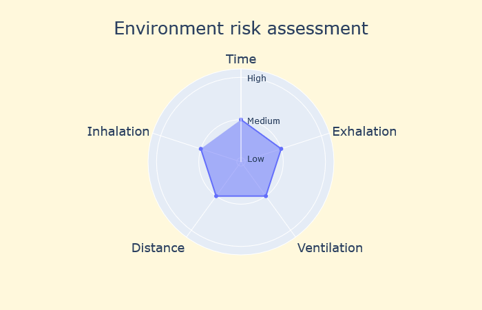

# Covid-19 Environment Risk Analysis

Infectious diseases are transmitted in many ways, including through direct contact with an infected individual or indirectly through contact with their bodily fluids, fomites (particles of infectious material), and exhaled respiritory droplets. With each new infectious disease there is a period of time whilst research is carried out until it is clear which modes of tranmission are most dominant in transmitting the diseases from an infectious to a susceptible person.

In the case of Covid-19 (caused by the SARS-Cov-2 virus), infection is thought to be transmitted in respiritory droplets, thought that doesn't mean that infection can be passed through other modes of transmission. There is debate whether transmission is predominantly due to spew, the large respiritory droplets which are ejected during breathing, sneezing and coughing; or whether infectious particles are also aerosolised. Spew droplets are typically greater than five to ten micrometers in size and fall close to the infectious person, whereas aerosols are much smaller and can travel great distances floating on air currents.

The extent to which respiritory droplets are aerosolised and whether they remain infectious is important, and determines whether additional mitigations are required. A disease which is predominantly transmitted in spew and where there is minimal aerosol generated is mitigated by recommending adequate physical distance between people, the wearing of face coverings, hand washing and making sure the environment is cleaned. However, if large numbers of respiritory particles are aerosolised and they remain in the air for long periods of time, travelling significant distances and creating clouds of concentrated infectious particles, then an increased number of people are likely to become infected. It should be noted that aerosolised infectious disease are not new and the health service has significant experience minimising risks associated with them.

The purpose of this risk assessment is to identify situations where infectious disease transmission through aerosol may be a significant risk, and where mitigations may need to be considered to reduce the risk of infection. It must be noted that whilst there is strong evidence that Covid-19 is transmitted as an aerosol, whether it is a greater risk than spew or other modes of transmission will take time to establish. Even if this tool identifies that that aerosol transmission is a risk, precautions will still need to be taken to minimise the risk of transmission due to spew and fomites by encouraging social distancing and hand washing.

# Installation

The risk assessment is implement as a DASH application that will run on any WSGI server. It was developed and tested using Visual Studio Code, though should work in any suitable Python environment.

Dependencies for the project are:
* dash == 1.4.1
* plotly == 4.7.1
* yaml == 0.1.7

